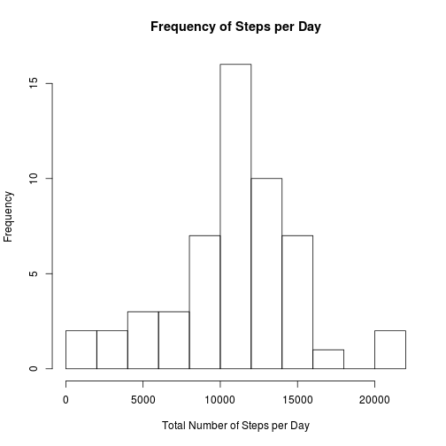
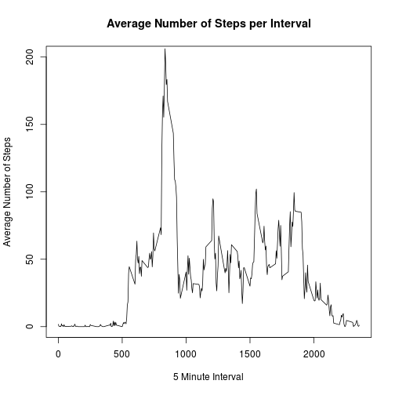
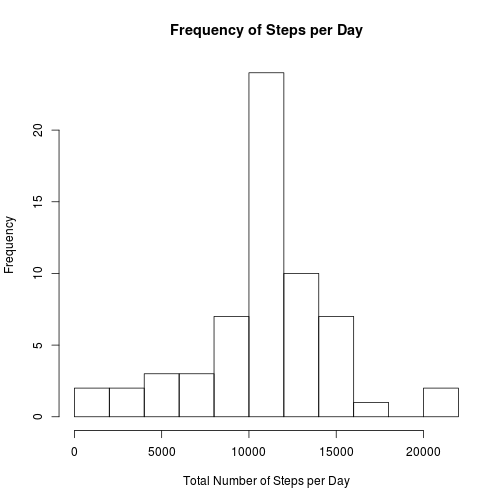
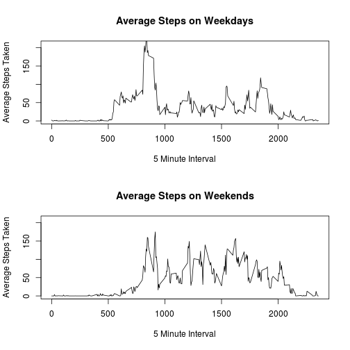

## Loading and preprocessing the data

```r
library(plyr)
#x is the dataset and z is the dataset with mean values per interval calculated
read.csv('./activity.csv',header=TRUE,colClasses=c('integer','Date','integer'))->x

z<-ddply(x,'interval',summarise,mean(steps,na.rm=TRUE))
```


## What is mean total number of steps taken per day?

```r
#y is the dataset with the sum of steps per day calculated
y<-ddply(x,"date",summarise,sum(steps))

hist(y[,2],breaks=10,main="Frequency of Steps per Day",xlab="Total Number of Steps per Day")
```

 
<br>
The average number of steps/day is

```r
mean(y[,2],na.rm=TRUE)
```

```
## [1] 10766.19
```
and the median is

```r
median(y[,2],na.rm=TRUE)
```

```
## [1] 10765
```

## What is the average daily activity pattern?

```r
plot(z[,1],z[,2],type='l',ylim=c(0,200),main="Average Number of Steps per Interval",ylab="Average Number of Steps",xlab='5 Minute Interval')
```

 
<br>the highest average number of steps in a mintue minute interval is


```r
z[z$..1==max(z[,2]),1]
```

```
## [1] 835
```

## Imputing missing values

The number of missing values are:

```r
nrow(x[is.na(x$steps),])
```

```
## [1] 2304
```


```r
w<-x
for ( i in seq(1,nrow(w))) {
  if (is.na(w[i,1])) {w[i,1]<-z[z$interval==w[i,3],2] } }

u<-ddply(w,"date",summarise,sum(steps))

hist(u[,2],breaks=10,main="Frequency of Steps per Day",xlab="Total Number of Steps per Day")
```

 

the new mean and median are:

```r
mean(u[,2],na.rm=TRUE)
```

```
## [1] 10766.19
```

```r
median(u[,2],na.rm=TRUE)
```

```
## [1] 10766.19
```

Because the NA's were filled in with the average values, the graph and mean values go unchanged, however the median changes slightly.


## Are there differences in activity patterns between weekdays and weekends?


```r
u<-x

a<-c()
for (i in seq(1,nrow(u))) {
  if(weekdays(u[i,2])=="Saturday" || weekdays(u[i,2])=="Sunday") {a[i]<-"Weekend"}
  else {a[i]<-"Weekday"} }
u$day<-a
u$day<-factor(u$day)

v<-ddply(u,c('interval','day'),summarise,mean(steps,na.rm=TRUE))

par(mfrow=c(2,1))

plot(v[v$day=="Weekday",1],v[v$day=="Weekday",3],type="l",xlim=c(0,2355),ylim=c(0,210),xlab = "5 Minute Interval",ylab="Average Steps Taken",main="Average Steps on Weekdays")
plot(v[v$day=="Weekend",1],v[v$day=="Weekend",3],type="l",xlim=c(0,2355),ylim=c(0,210),xlab = "5 Minute Interval",ylab="Average Steps Taken",main="Average Steps on Weekends")
```

 
