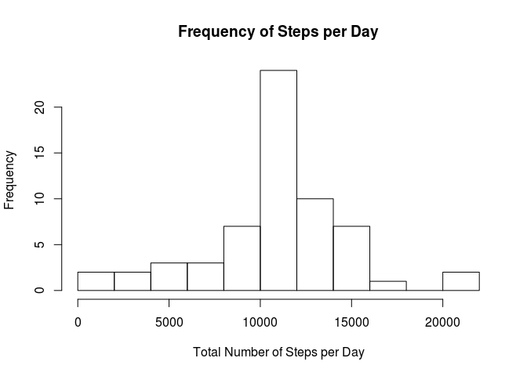

# Reproducible Research: Peer Assessment 1


## Loading and preprocessing the data

```r
library(plyr)
read.csv('./activity.csv',header=TRUE,colClasses=c('integer','Date','integer'))->x
y<-ddply(x,"date",summarise,sum(steps))
z<-ddply(x,'interval',summarise,mean(steps,na.rm=TRUE))
```

```r
## What is mean total number of steps taken per day?
```

```r
hist(y[,2],breaks=10,main="Frequency of Steps per Day",xlab="Total Number of Steps per Day")
```

 

```r
###The average number of steps/day is
mean(y[,2],na.rm=TRUE)
```

```
## [1] 10766.19
```

```r
###and the median is
median(y[,2],na.rm=TRUE)
```

```
## [1] 10765
```

```r
## What is the average daily activity pattern?
```

```r
plot(z[,1],z[,2],type='l',ylim=c(0,200),main="Average Number of Steps per Interval",ylab="Average Number of Steps",xlab='5 Minute Interval')
```

 

```r
## Imputing missing values
```

```r
####the highest average number of steps in a mintue minute interval is
z[z$..1==max(z[,2]),1]
```

```
## [1] 835
```

```r
w<-x
for ( i in seq(1,nrow(w))) {
  if (is.na(w[i,1])) {w[i,1]<-z[z$interval==w[i,3],2] } }

u<-ddply(x,"date",summarise,sum(steps))

hist(u[,2],breaks=10,main="Frequency of Steps per Day",xlab="Total Number of Steps per Day")
```

 

```r
####The 'new' mean is
mean(u[,2],na.rm=TRUE)
```

```
## [1] 10766.19
```

```r
####and the median would be
median(u[,2],na.rm=TRUE)
```

```
## [1] 10765
```

```r
## Are there differences in activity patterns between weekdays and weekends?
```


